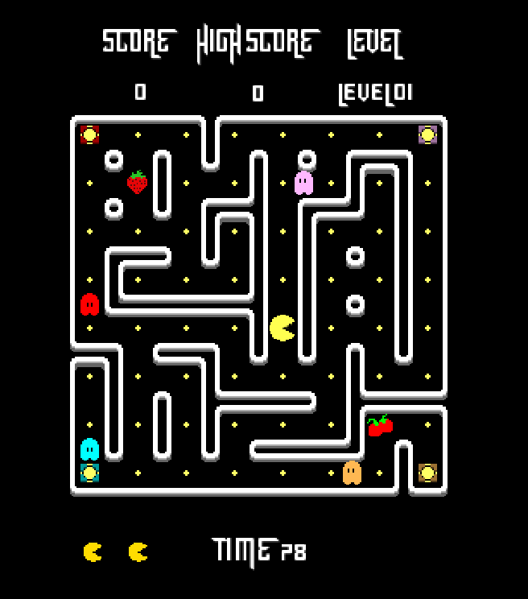

## Hi there 👋

<!--
**Juanpi194/Juanpi194** is a ✨ _special_ ✨ repository because its `README.md` (this file) appears on your GitHub profile.

Here are some ideas to get you started:

- 🔭 I’m currently working on ...
- 🌱 I’m currently learning ...
- 👯 I’m looking to collaborate on ...
- 🤔 I’m looking for help with ...
- 💬 Ask me about ...
- 📫 How to reach me: ...
- 😄 Pronouns: ...
- ⚡ Fun fact: ...
-->

💻 Aspiring software developer with a background in electronic engineering and currently studying at 42 Madrid.
I'm passionate about programming, problem-solving, and understanding how things work under the hood.

---
### 🚀 About me
- 🎓 Studied Electronic Engineering (Telecommunications) at UPM
- 📚 Currently studying at 42 Madrid
- 🧠 Strong technical mindset with a hands-on, self-taught approach
- ⚡ Interested in systems, backend development, and low-level programming

---
### 🛠️ Technologies

### Programming languages

### Tools

### WIP

---
### 📌What I'm working on
Improving my low-level programming skills (C/C++)
Learning containerization with Docker
Exploring Rust and modern systems programming
Building practical projects to grow as a developer

---
### 🌱 Goals
To grow as a developer by working on meaningful projects and building solid, well-designed software.

---
### 📫 Contact
- [LinkedIn](https://www.linkedin.com/in/juan-pablo-vizca%C3%ADno-delgado-815b17351/?skipRedirect=true) 🐊
- Email: juanpiviz194@gmail.com

---
## 📌 42 Projects

### 🥥 Pacman
Description...
Visuals were done by other 42 student (smarin-s)

- 💻 Language: Python
- 🎯 What I learned: ...
- 🔧 Difficulty: hard

### 📓 Libft
Description...

- 💻 Language: C
- 🎯 What I learned: ...
- 🔧 Difficulty: medium

### 🤖 RAG
Description...

- 💻 Language: Python
- 🎯 What I learned: ...
- 🔧 Difficulty: hard

### 🎮 TAP
Description...

- 💻 Language: C++
- 🎯 What I learned: C++ bases, sockets, ...
- 🔧 Difficulty: hard

---
## 🧠 Own Projects
Not yet...

## Languages

---
⭐ Always open to learning, collaborating, and new challenges (NOT AI)
